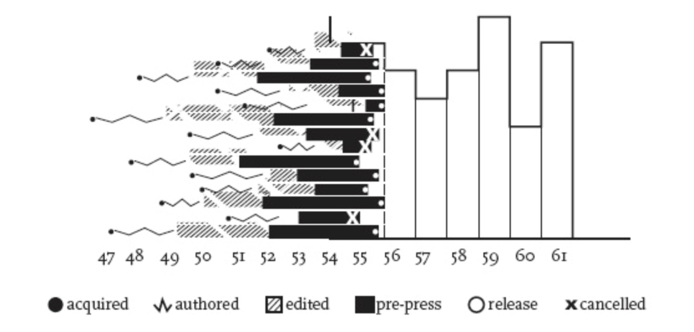

<h1>Acedemic Blog Post</h1>

<h2>Prompt</h2>
Both <b>Moretti</b> and <b>Drucker</b> argue that visual forms (e.g. graphs, maps, etc.) can and should be used to represent cultural phenomena (e.g. the experience of temporality, rises and falls in genre, etc.). Moving between written and visual mediums of expression offers a model for the next generation of digital humanities scholarship, where readers are asked to think critically across both textual and graphical modes. As such, digital humanities scholarship should increasingly create multimodal scholarship where readers interpret both the text and any other media (such as graphs, images, audio, and so on). <b>Creating scholarship that asks readers to interpret across multiple modes will distinguish (treat as different) digital humanities scholarship from scholarship in other fields.</b> 

<h2>Another Digital Humanities Revolution?</h2>
<!-- Intro -->

Scholarly readings can be very difficult to understand, interpret, and absorb which is many times due to extensive amounts of complex textual context. By increasingly adding multimodal media into digital humanities scholarship, the skill of interpreting multimodal readings will be developed by readers in the scholarship. This would also make the digital humanities scholarship more understandable and appealing, specifically on the reading side of it. When looking at comprehensive readings, the addition of a visual, graph, sound etc.,  element to help the reader grasp the information. Incorporating multimodality also brings the text to life in a way that visualizes exactly what the text is talking about, while showing that visualization can be created with any field. Although the readings required in the digital humanities scholarship are being read by university students, they are commonly intimidating. 

This can be avoided by adding multimodal components. For example, if a visual learner opens up a purely textual reading, there is automatically a turn off and  preconceived discouragement. Although scholarly articles are consumed by higher level students, pure text is unacceptable. Having multimodal elements in scholarly articles does not take away any seriousness or credibility. This would indeed make readings more accessible for more than just type of learner. Auditory and visual learners matter just as much as people who learn through reading. Having said that, all digital humanities publications should have some sort of multimodal aspect to it. This can be achieved by setting a standard in place to encourage it and ultimately making it mandatory. 

<!-- Morretti & Drucker -->
Donec pellentesque, metus quis luctus tincidunt, nulla ligula auctor diam, aliquet finibus lacus eros nec augue. Pellentesque molestie nisl ligula, vel lacinia mauris commodo elementum. Nunc id ultricies sem. Pellentesque vulputate, diam non elementum porttitor, ex quam imperdiet nunc, ut iaculis nibh diam ut magna. Curabitur quis consequat metus. Sed massa neque, fermentum a magna ut, aliquet luctus neque. Fusce non imperdiet velit.

<h4>Figure One</h4>

<!-- Voyant -->

<h4>Figure Two</h4>
<!--	Exported from Voyant Tools (voyant-tools.org).
The iframe src attribute below uses a relative protocol to better function with both
http and https sites, but if you're embedding this into a local web page (file protocol)
you should add an explicit protocol (https if you're using voyant-tools.org, otherwise
it depends on this server.
Feel free to change the height and width values or other styling below: -->
<iframe style='width: 637px; height: 477px;' src='https://voyant-tools.org/tool/Cirrus/?visible=35&corpus=5ef49eef5dd42c75f80f6336a240f1fa'></iframe>

<iframe style='width: 100%; height: 1000px;' src="processing/index.html"></iframe>

<!-- DM versus Other feilds -->
Aliquam sagittis tellus at nulla euismod, non sagittis libero iaculis. Cras condimentum faucibus mauris, quis aliquet dolor pretium at. Sed non ultricies metus, sit amet tincidunt justo. Donec et ipsum feugiat, semper nunc lobortis, volutpat elit. Integer mollis urna vitae volutpat rutrum. Mauris gravida diam dolor. Fusce vulputate orci velit, sit amet elementum tellus congue a. Sed viverra varius quam, non rutrum orci sodales id. Vivamus condimentum ipsum sit amet lorem aliquam, in gravida nisl interdum. Quisque et diam magna. Donec magna lacus, pellentesque ut ultricies non, pulvinar et nibh. Nulla consectetur lacinia scelerisque. Orci varius natoque penatibus et magnis dis parturient montes, nascetur ridiculus mus.

<h2>References</h2>

Go Back... [Home](README.md)

